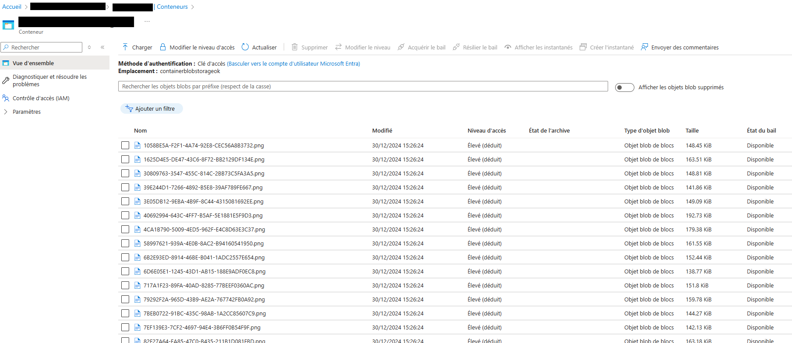
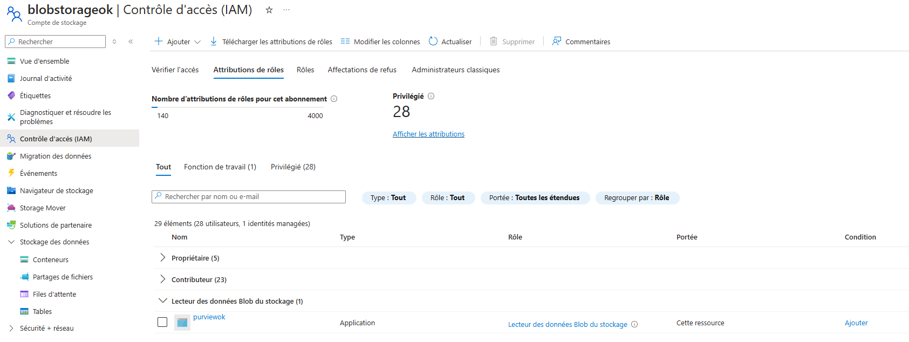
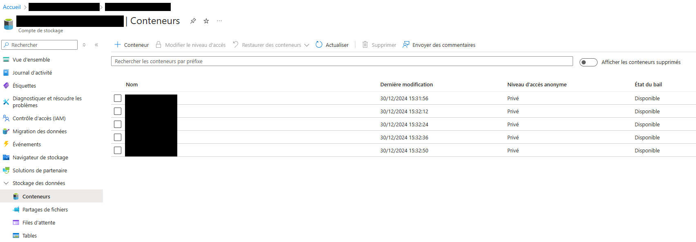
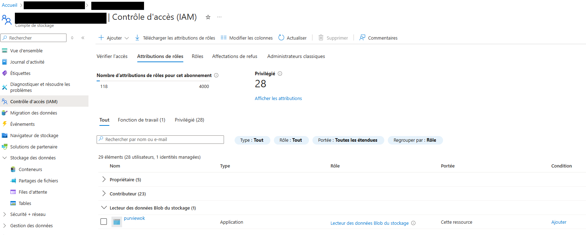
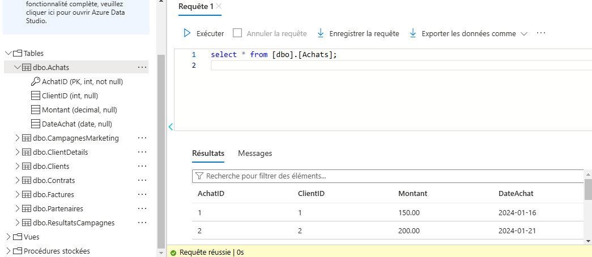
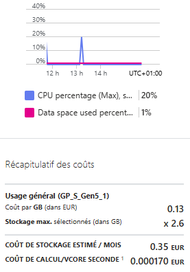
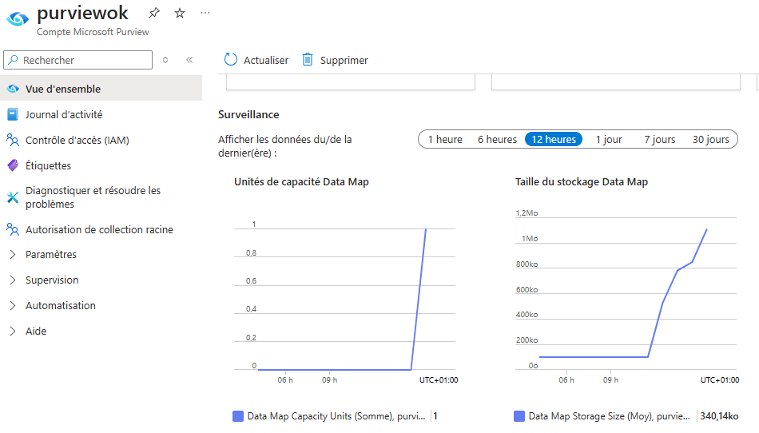
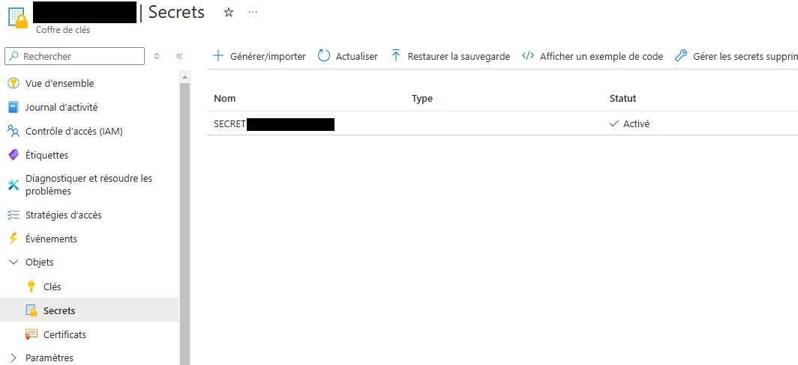
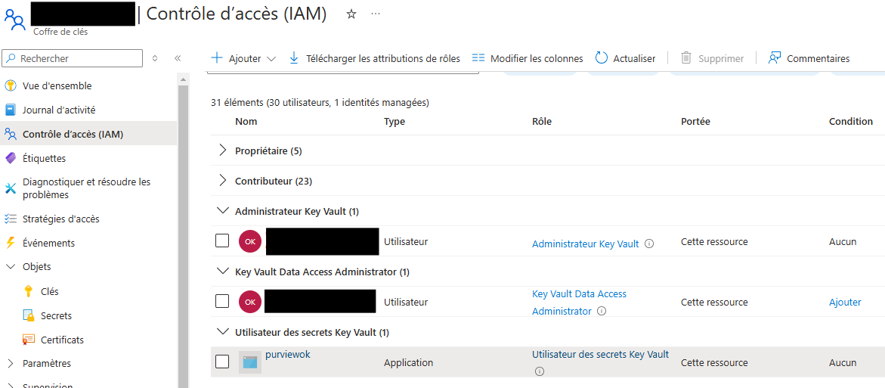

# **Configuration des composants clés de l'infrastructure**

Bienvenue dans la documentation de configuration des principaux composants de l'infrastructure Azure. Vous trouverez ci-dessous des étapes claires et des captures pour vous guider dans la configuration de chaque composant.

---

## **Azure Blob Storage**

### Création de la ressource
La ressource `Azure Blob Storage` a été créée dans le groupe de ressources spécifié.

### Configuration IAM
Voici la configuration de l'IAM pour la ressource `Azure Blob Storage` :

---

## **Azure Data Lake Storage Gen2**

### Création de la ressource
La ressource `Azure Data Lake Storage Gen2` a été créée dans le groupe de ressources spécifié.

### Configuration IAM
Voici la configuration de l'IAM pour la ressource `Azure Data Lake Storage Gen2` :

---

## **Azure SQL Database**

### Création de la ressource
La ressource `Azure SQL Database` a été créée dans le groupe de ressources spécifié, avec le serveur SQL Azure associé.

### Analyse des coûts
Voici une capture illustrant le coût associé à la ressource `Azure SQL Database` :

---

## **Microsoft Purview**

### Création de la ressource
La ressource `Microsoft Purview` a été créée dans le groupe de ressources spécifié.

---

## **Azure Key Vault**

### Création de la ressource
La ressource `Key Vault` a été créée dans le groupe de ressources spécifié.

### Configuration IAM
Voici la configuration de l'IAM pour la ressource `Key Vault` :

---
