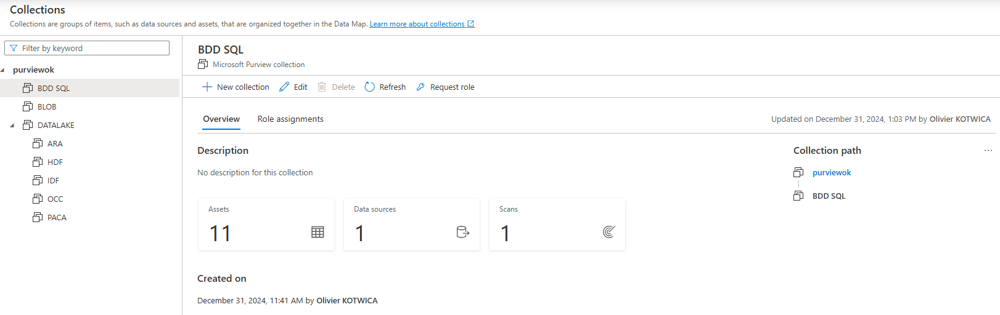
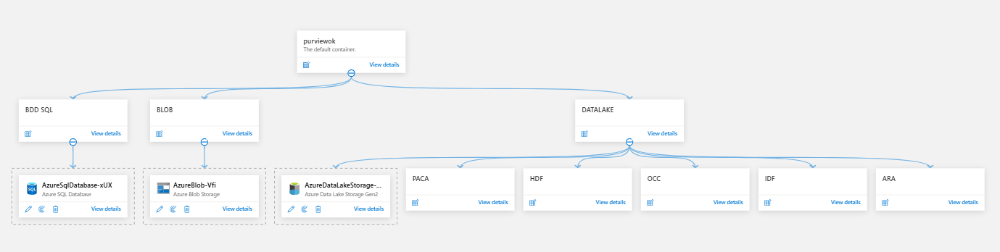
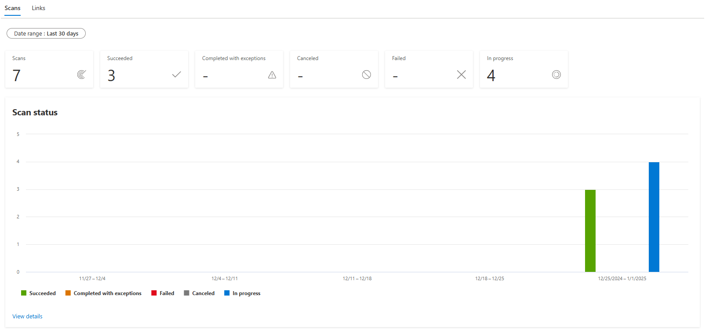
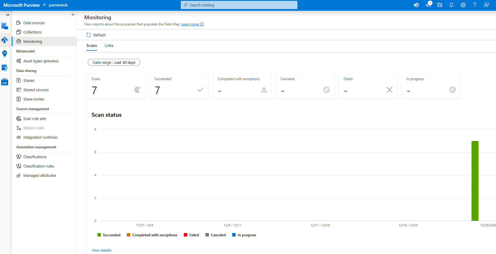
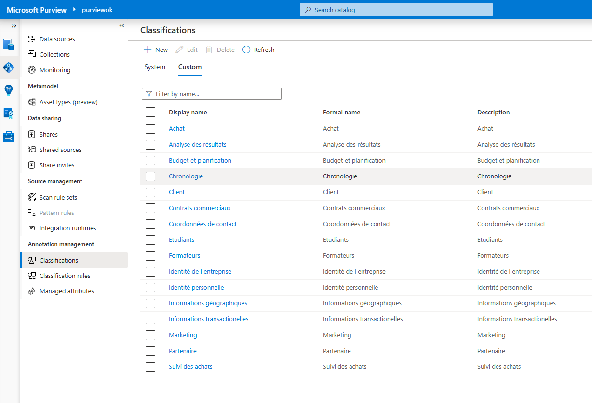
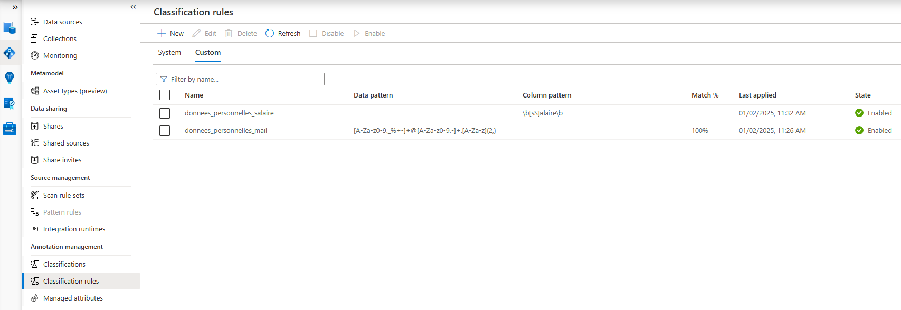
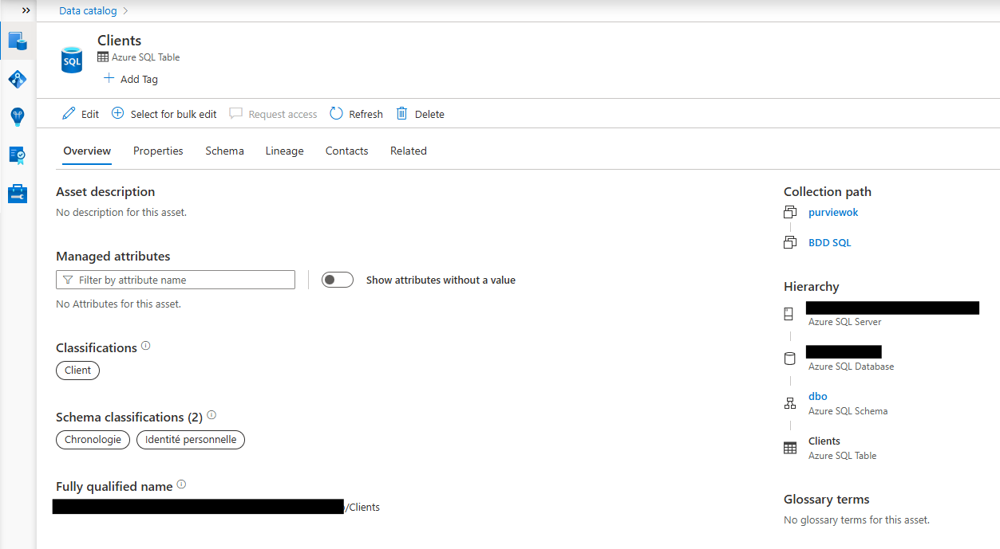
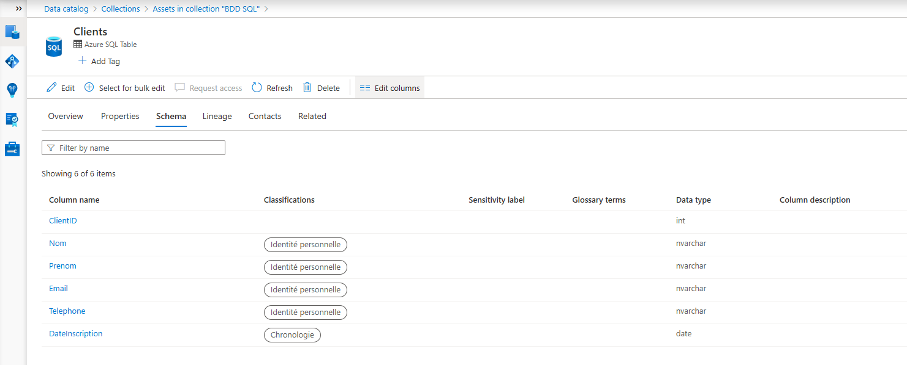
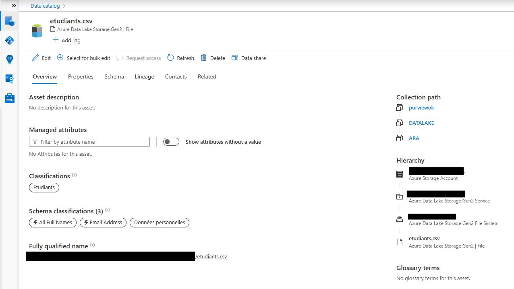
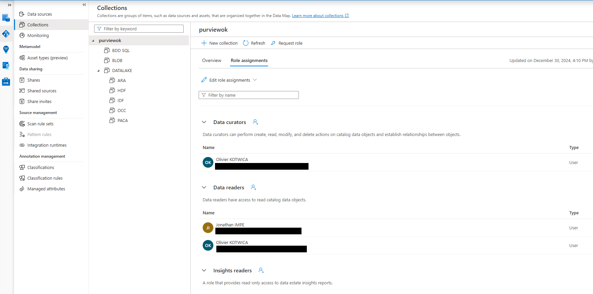

# **Configuration de Purview**

Creation des collections. 

# 
  
Attribution des sources aux differentes collections. 

# 

Suivi des scan (dans monitoring). 

# 

Creation des classifications pour les differentes collections. On peut attribuer une classification manuellement a une ou plusieures tables ou a un ou plusieurs champs. 

# 

On peut egalement creer des regles de classification pour attribuer des classifications lors des scan. 

# 

Classification de la BDD SQL. Dans Overview, on visualise les classifications appliquer a l ensemble de la table et a certains champs. Dans Schema, on visualise uniquement les classifications des champs. 

# 

Classification des fichiers.csv du datalake. 

# 

Gestion des roles dans purview. Ici ajout d une personne (Jonathan) dans le role data reader. 

# 

